# class05: data viz with ggplot
Seona Patel (PID: A69035519)

Today we are playing with plotting and graphics in R.

There are lots of ways to make cool figures in R. There is “base” R
graphics (`plot()`, `hist()`, `boxplot()`, etc.)

There is also add-on packages, like **ggplot**

``` r
head(cars, 3)
```

      speed dist
    1     4    2
    2     4   10
    3     7    4

Let’s plot this with “base” R:

``` r
plot(cars)
```


``` r
mtcars
```

                         mpg cyl  disp  hp drat    wt  qsec vs am gear carb
    Mazda RX4           21.0   6 160.0 110 3.90 2.620 16.46  0  1    4    4
    Mazda RX4 Wag       21.0   6 160.0 110 3.90 2.875 17.02  0  1    4    4
    Datsun 710          22.8   4 108.0  93 3.85 2.320 18.61  1  1    4    1
    Hornet 4 Drive      21.4   6 258.0 110 3.08 3.215 19.44  1  0    3    1
    Hornet Sportabout   18.7   8 360.0 175 3.15 3.440 17.02  0  0    3    2
    Valiant             18.1   6 225.0 105 2.76 3.460 20.22  1  0    3    1
    Duster 360          14.3   8 360.0 245 3.21 3.570 15.84  0  0    3    4
    Merc 240D           24.4   4 146.7  62 3.69 3.190 20.00  1  0    4    2
    Merc 230            22.8   4 140.8  95 3.92 3.150 22.90  1  0    4    2
    Merc 280            19.2   6 167.6 123 3.92 3.440 18.30  1  0    4    4
    Merc 280C           17.8   6 167.6 123 3.92 3.440 18.90  1  0    4    4
    Merc 450SE          16.4   8 275.8 180 3.07 4.070 17.40  0  0    3    3
    Merc 450SL          17.3   8 275.8 180 3.07 3.730 17.60  0  0    3    3
    Merc 450SLC         15.2   8 275.8 180 3.07 3.780 18.00  0  0    3    3
    Cadillac Fleetwood  10.4   8 472.0 205 2.93 5.250 17.98  0  0    3    4
    Lincoln Continental 10.4   8 460.0 215 3.00 5.424 17.82  0  0    3    4
    Chrysler Imperial   14.7   8 440.0 230 3.23 5.345 17.42  0  0    3    4
    Fiat 128            32.4   4  78.7  66 4.08 2.200 19.47  1  1    4    1
    Honda Civic         30.4   4  75.7  52 4.93 1.615 18.52  1  1    4    2
    Toyota Corolla      33.9   4  71.1  65 4.22 1.835 19.90  1  1    4    1
    Toyota Corona       21.5   4 120.1  97 3.70 2.465 20.01  1  0    3    1
    Dodge Challenger    15.5   8 318.0 150 2.76 3.520 16.87  0  0    3    2
    AMC Javelin         15.2   8 304.0 150 3.15 3.435 17.30  0  0    3    2
    Camaro Z28          13.3   8 350.0 245 3.73 3.840 15.41  0  0    3    4
    Pontiac Firebird    19.2   8 400.0 175 3.08 3.845 17.05  0  0    3    2
    Fiat X1-9           27.3   4  79.0  66 4.08 1.935 18.90  1  1    4    1
    Porsche 914-2       26.0   4 120.3  91 4.43 2.140 16.70  0  1    5    2
    Lotus Europa        30.4   4  95.1 113 3.77 1.513 16.90  1  1    5    2
    Ford Pantera L      15.8   8 351.0 264 4.22 3.170 14.50  0  1    5    4
    Ferrari Dino        19.7   6 145.0 175 3.62 2.770 15.50  0  1    5    6
    Maserati Bora       15.0   8 301.0 335 3.54 3.570 14.60  0  1    5    8
    Volvo 142E          21.4   4 121.0 109 4.11 2.780 18.60  1  1    4    2

``` r
head(mtcars)
```

                       mpg cyl disp  hp drat    wt  qsec vs am gear carb
    Mazda RX4         21.0   6  160 110 3.90 2.620 16.46  0  1    4    4
    Mazda RX4 Wag     21.0   6  160 110 3.90 2.875 17.02  0  1    4    4
    Datsun 710        22.8   4  108  93 3.85 2.320 18.61  1  1    4    1
    Hornet 4 Drive    21.4   6  258 110 3.08 3.215 19.44  1  0    3    1
    Hornet Sportabout 18.7   8  360 175 3.15 3.440 17.02  0  0    3    2
    Valiant           18.1   6  225 105 2.76 3.460 20.22  1  0    3    1

Let’s plot `mpg` vs `disp`

``` r
plot(mtcars$mpg, mtcars$disp, pch=16)
```

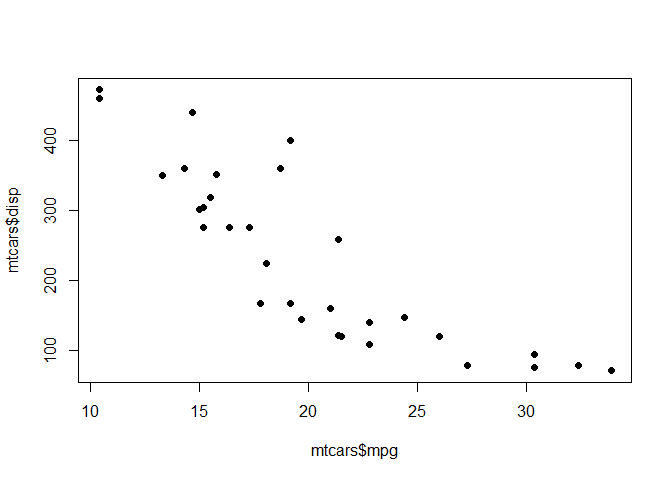

``` r
hist(mtcars$mpg)
```

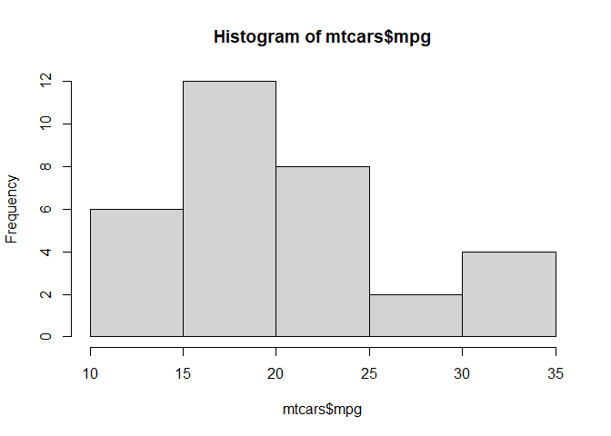

## GGPLOT

The main function in the ggplot2 package is **ggplot()** first I need to
install the **ggplot2** package. I can install any package with the
function`install.packages()` \> **N.B.** Never want to run
`install.packages()` in my quarto document because it will install it
every time you render the page. Instead, install it in the console so
you only have to do it once.

``` r
library(ggplot2)
```

    Warning: package 'ggplot2' was built under R version 4.5.2

``` r
ggplot(cars) +
  aes(x=speed, y=dist) +
  geom_point()
```


``` r
ggplot(cars) +
  aes(speed) +
  geom_histogram()
```

    `stat_bin()` using `bins = 30`. Pick better value `binwidth`.

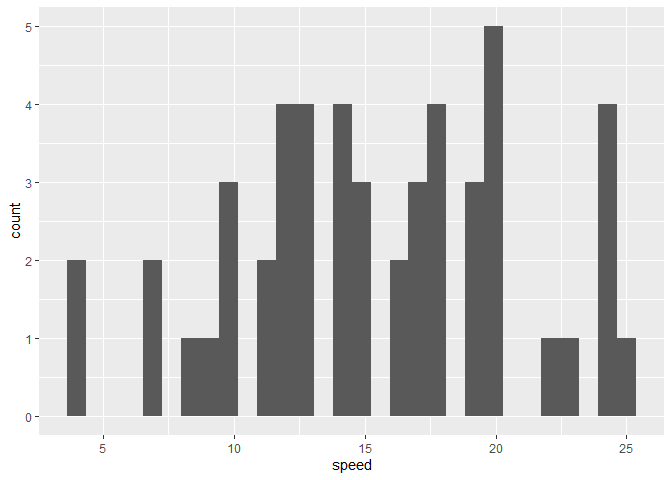

Every ggplot needs at least 3 things:

- The **data** (given with `ggplot(cars)`)
- The **aesthetic** mapping (given with `aes()`)
- The **geom** (given by `geom_point()`)

> For simple canned graphs “base” R is nearly always faster (in writing
> code and running)

### Adding more layers

Let’s add a line and a title, subtitle, and caption as well as custom
axis labels

``` r
library(ggplot2)
ggplot(cars) +
  aes(x=speed, y=dist) +
  geom_point() +
  geom_line()
```

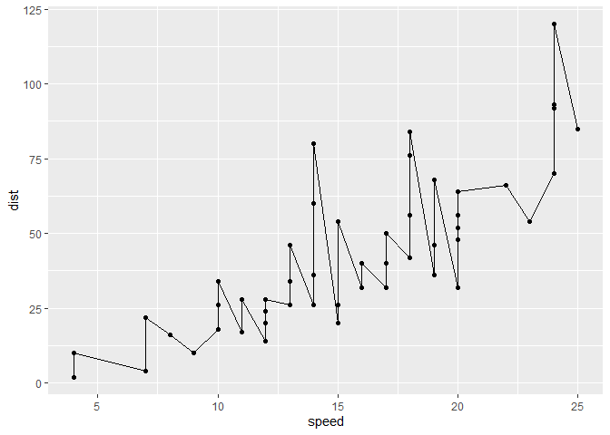

``` r
library(ggplot2)
ggplot(cars) +
  aes(x=speed, y=dist) +
  geom_point() +
  geom_smooth(method = 'lm', se=FALSE)
```

    `geom_smooth()` using formula = 'y ~ x'

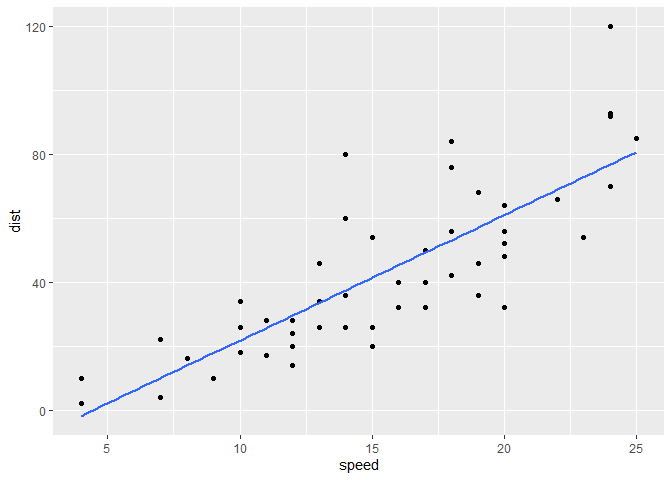

``` r
library(ggplot2)
ggplot(cars) +
  aes(x=speed, y=dist) +
  geom_point() +
  geom_smooth(method = 'lm', se=FALSE) + 
  labs(title = "Silly Plot", x= "Speed (MPH)", y="Distance (ft)", caption = "when is tea time anyway??") +
  theme_bw()
```

    `geom_smooth()` using formula = 'y ~ x'

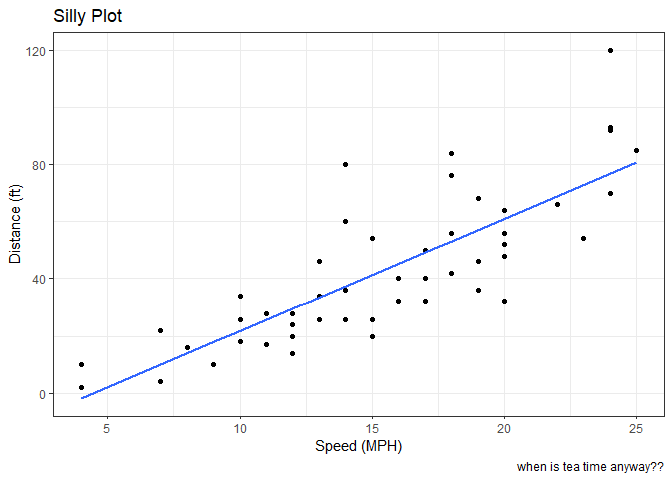

\##Plot some expression data

``` r
url <- "https://bioboot.github.io/bimm143_S20/class-material/up_down_expression.txt"
genes <- read.delim(url)
head(genes)
```

            Gene Condition1 Condition2      State
    1      A4GNT -3.6808610 -3.4401355 unchanging
    2       AAAS  4.5479580  4.3864126 unchanging
    3      AASDH  3.7190695  3.4787276 unchanging
    4       AATF  5.0784720  5.0151916 unchanging
    5       AATK  0.4711421  0.5598642 unchanging
    6 AB015752.4 -3.6808610 -3.5921390 unchanging

> Q1. How many genes are in this wee dataset?

There are 5196 rows in this dataset

> Q2. How many columns are there are what are their names?

There are 4 columns in this dataset

``` r
colnames(genes)
```

    [1] "Gene"       "Condition1" "Condition2" "State"     

The column names are Gene, Condition1, Condition2, State

> Q3. How many “up” regulated genes are there?

There are 127 UP genes

``` r
table(genes$State)
```


          down unchanging         up 
            72       4997        127 

> Q4 . What fraction of total genes is up-regulated in this dataset?

``` r
round( table(genes$State)/nrow(genes) * 100, 2 )
```


          down unchanging         up 
          1.39      96.17       2.44 

``` r
p <- ggplot(genes) + 
    aes(x=Condition1, y=Condition2, col=State) +
    geom_point() +
  scale_color_manual(values=c("blue", "gray", "red"))
```

``` r
p + labs(title='look at me')
```

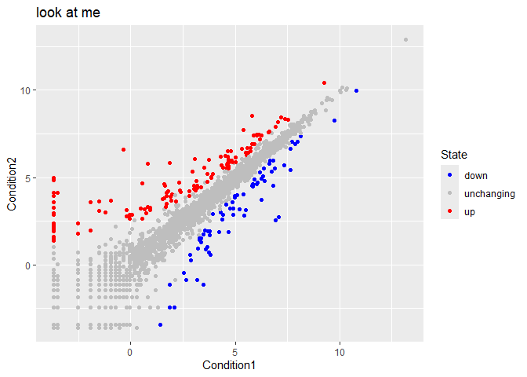

Silly exmaple of adding labels

``` r
library('ggrepel')
```

``` r
ggplot(genes) +  
  aes(x=Condition1, y=Condition2, col=State, label=Gene) +
  geom_text_repel(max.overlaps = 60)+
  geom_point() +
  scale_color_manual(values=c("blue", "gray", "red")) +
  theme_bw()
```

    Warning: ggrepel: 5155 unlabeled data points (too many overlaps). Consider
    increasing max.overlaps

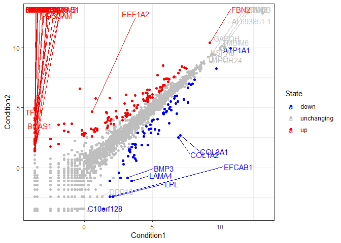

## Going Further

Playing with some different layers and the gapminder dataset

``` r
url <- "https://raw.githubusercontent.com/jennybc/gapminder/master/inst/extdata/gapminder.tsv"

gapminder <- read.delim(url)
```

``` r
head(gapminder)
```

          country continent year lifeExp      pop gdpPercap
    1 Afghanistan      Asia 1952  28.801  8425333  779.4453
    2 Afghanistan      Asia 1957  30.332  9240934  820.8530
    3 Afghanistan      Asia 1962  31.997 10267083  853.1007
    4 Afghanistan      Asia 1967  34.020 11537966  836.1971
    5 Afghanistan      Asia 1972  36.088 13079460  739.9811
    6 Afghanistan      Asia 1977  38.438 14880372  786.1134

``` r
tail(gapminder)
```

          country continent year lifeExp      pop gdpPercap
    1699 Zimbabwe    Africa 1982  60.363  7636524  788.8550
    1700 Zimbabwe    Africa 1987  62.351  9216418  706.1573
    1701 Zimbabwe    Africa 1992  60.377 10704340  693.4208
    1702 Zimbabwe    Africa 1997  46.809 11404948  792.4500
    1703 Zimbabwe    Africa 2002  39.989 11926563  672.0386
    1704 Zimbabwe    Africa 2007  43.487 12311143  469.7093

A first plot alpha in geom_point makes the points more transparent
(useful when you have a lot of overlapping datapoints)

``` r
ggplot(gapminder)+
  aes(gdpPercap, lifeExp, col=continent, size=pop) +
  geom_point(alpha =0.2)+
  facet_wrap(~continent) +
  theme_bw()
```

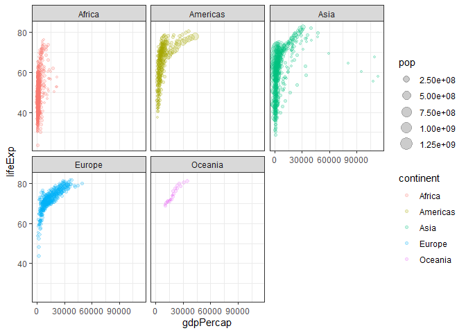

``` r
library(gapminder)
```


    Attaching package: 'gapminder'

    The following object is masked _by_ '.GlobalEnv':

        gapminder

``` r
library(gganimate)

# Setup nice regular ggplot of the gapminder data
ggplot(gapminder, aes(gdpPercap, lifeExp, size = pop, colour = country)) +
  geom_point(alpha = 0.7, show.legend = FALSE) +
  scale_colour_manual(values = country_colors) +
  scale_size(range = c(2, 12)) +
  scale_x_log10() +
  # Facet by continent
  facet_wrap(~continent) +
  # Here comes the gganimate specific bits
  labs(title = 'Year: {frame_time}', x = 'GDP per capita', y = 'life expectancy') +
  transition_time(year) +
  shadow_wake(wake_length = 0.1, alpha = FALSE)
```

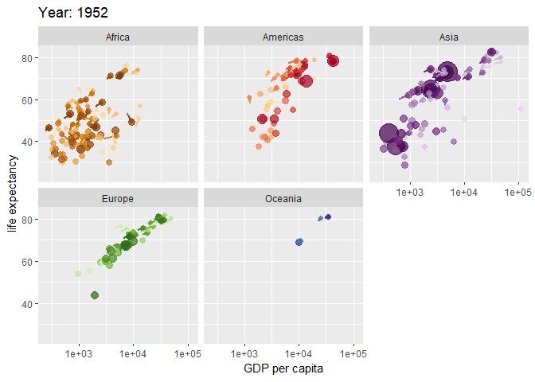

``` r
library(patchwork)

# Setup some example plots 
p1 <- ggplot(mtcars) + geom_point(aes(mpg, disp))
p2 <- ggplot(mtcars) + geom_boxplot(aes(gear, disp, group = gear))
p3 <- ggplot(mtcars) + geom_smooth(aes(disp, qsec))
p4 <- ggplot(mtcars) + geom_bar(aes(carb))

# Use patchwork to combine them here:
(p1 | p2 | p3) /
      p4
```

    `geom_smooth()` using method = 'loess' and formula = 'y ~ x'

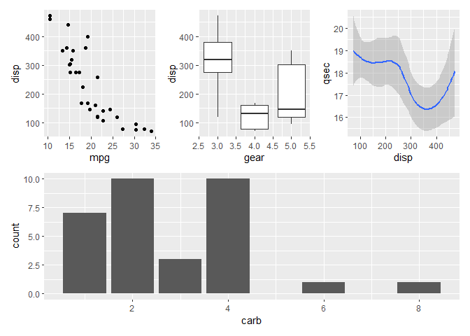
