# Class 7: Machine Learning 1
Seona Patel (PID: A69035519)

Today we will begin our exploration of some “classical” machine learning
approaches. We will start with clustering.: Let’s first make up some
data to cluster where we know what the answer should be.

`rnorm()` gives you a bunch of random numbers within a normal
distribution and you can set the mean of it

``` r
hist(rnorm(1000,))
```

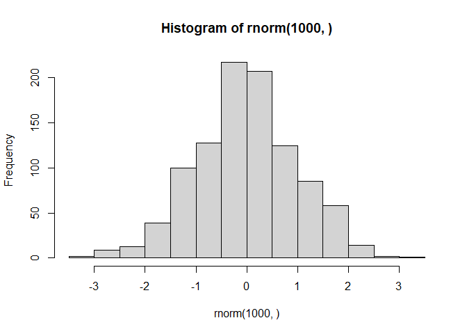

``` r
x <- c(rnorm(30, mean=-3),
rnorm(30, mean=3))

y <- rev(x)
x <- cbind(x,y)
head(x)
```

                 x        y
    [1,] -2.696413 3.453454
    [2,] -2.069552 1.027705
    [3,] -3.769697 1.650296
    [4,] -1.560792 2.250121
    [5,] -3.123111 3.251997
    [6,] -2.944933 2.836089

A wee peak at x with `plot()`:

``` r
plot(x)
```

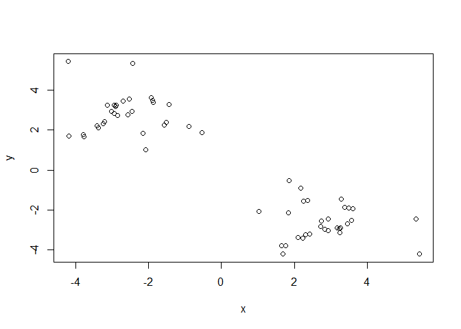

The main function in “base” R for K-means clustering is called
`kmeans()`

``` r
k <- kmeans(x, centers=2)
k
```

    K-means clustering with 2 clusters of sizes 30, 30

    Cluster means:
              x         y
    1 -2.611857  2.808855
    2  2.808855 -2.611857

    Clustering vector:
     [1] 1 1 1 1 1 1 1 1 1 1 1 1 1 1 1 1 1 1 1 1 1 1 1 1 1 1 1 1 1 1 2 2 2 2 2 2 2 2
    [39] 2 2 2 2 2 2 2 2 2 2 2 2 2 2 2 2 2 2 2 2 2 2

    Within cluster sum of squares by cluster:
    [1] 51.0189 51.0189
     (between_SS / total_SS =  89.6 %)

    Available components:

    [1] "cluster"      "centers"      "totss"        "withinss"     "tot.withinss"
    [6] "betweenss"    "size"         "iter"         "ifault"      

> Q. How big are the clusters (i.e their size)?

``` r
k$size
```

    [1] 30 30

> Q. What clusters do my data points reside in?

``` r
k$cluster
```

     [1] 1 1 1 1 1 1 1 1 1 1 1 1 1 1 1 1 1 1 1 1 1 1 1 1 1 1 1 1 1 1 2 2 2 2 2 2 2 2
    [39] 2 2 2 2 2 2 2 2 2 2 2 2 2 2 2 2 2 2 2 2 2 2

> Q. Make a plot of our data colored by cluster assignment - i.e. Make a
> result figure…

``` r
plot(x, col=c('red', 'blue'))
```

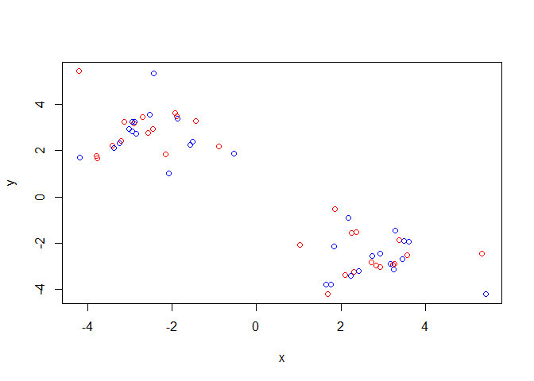

``` r
plot(x, col=k$cluster)
points(k$centers, col="blue", pch=15)
```

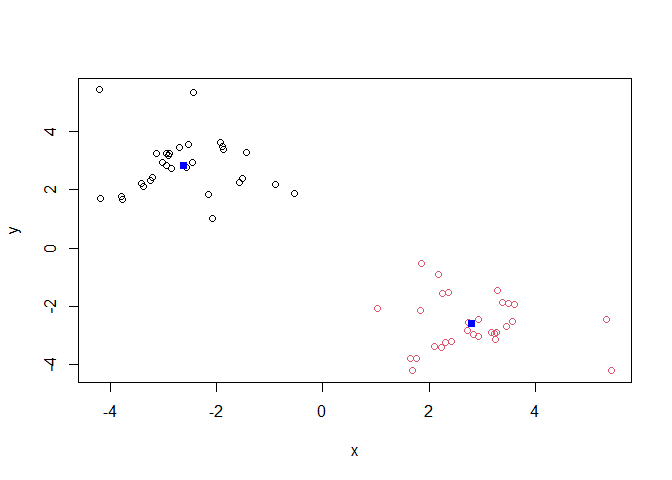

> Q. Cluster with k-means into 4 clusters and plot your results as
> above.

``` r
k4 <- kmeans(x, centers=4)
plot(x, col=k4$cluster)
points(k4$centers, col="blue", pch=15)
```

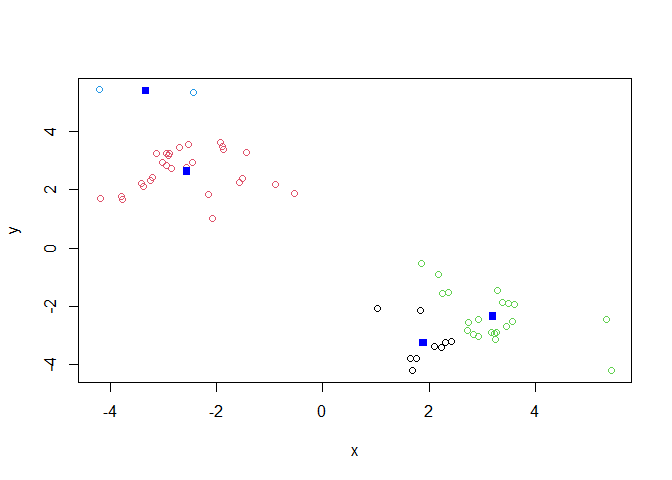

> Q. Run k-means with centers (i.e. values of k) equal 1 to 6 and store
> the total within-cluser sum of squares for each one and then plot
> totwithinss vs k

``` r
k$tot.withinss
```

    [1] 102.0378

You can do this the brute force way…or use a for loop

``` r
ans <- NULL
for (i in 1:6) {
  ans <- c(ans, kmeans(x, centers=i)$tot.withinss)
  
}
ans 
```

    [1] 983.56145 102.03780  86.12180  71.64691  56.14875  44.17753

Make a “scree-plot”

``` r
plot(ans, typ='b')
```

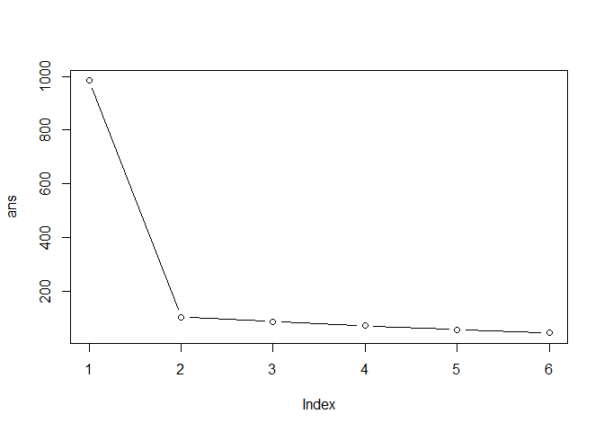

## Hierarchical Clustering

The main function in “base” R for this is called `hclust()`

``` r
# dist is the Euclidian distance
d <- dist(x)
hc <- hclust(d)
hc
```


    Call:
    hclust(d = d)

    Cluster method   : complete 
    Distance         : euclidean 
    Number of objects: 60 

This output is not super useful. Let’s plot a clustering tree:

``` r
plot(hc)
abline(h=8, col="red")
```

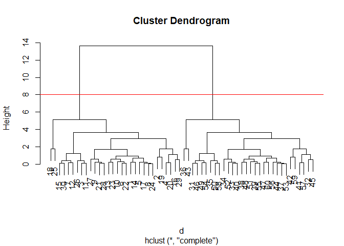

Notice that the numbers less than 30 are on the right and greater than
30 are on the left. The height is the distance by which these are joined
together. As you go up the axis, these points are further apart. So
you’re really looking for the big goalposts/crossbars.

To obtain clusters from our `hclust()` result object, **hc** we “cut”
the tree to yield different sub-branches. For this we will use the
`cutree()` function

``` r
grps <- cutree(hc, h=8)
grps
```

     [1] 1 1 1 1 1 1 1 1 1 1 1 1 1 1 1 1 1 1 1 1 1 1 1 1 1 1 1 1 1 1 2 2 2 2 2 2 2 2
    [39] 2 2 2 2 2 2 2 2 2 2 2 2 2 2 2 2 2 2 2 2 2 2

``` r
plot(x, col=grps)
```

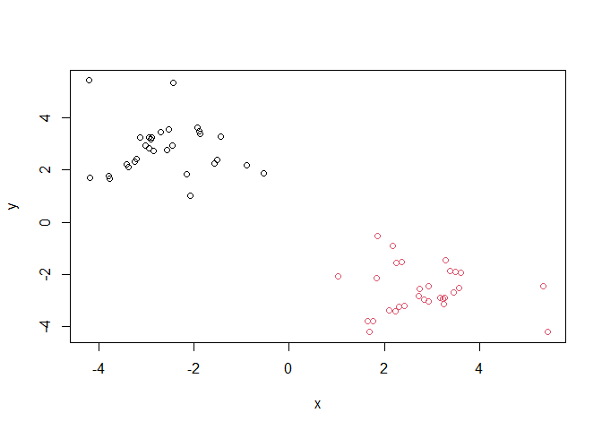

``` r
library(pheatmap)
pheatmap(x)
```

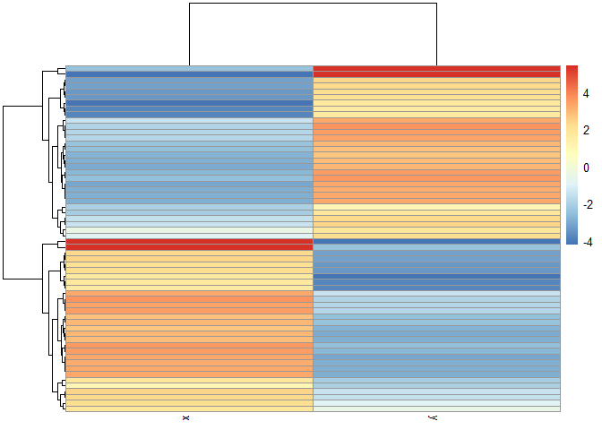

## Principal Component Analysis (PCA)

``` r
url <- "https://tinyurl.com/UK-foods"
x <- read.csv(url)
```

> Q1. How many rows and columns are in your new data frame named x? What
> R functions could you use to answer this questions?

## Complete the following code to find out how many rows and columns are in x?

``` r
dim(x)
```

    [1] 17  5

``` r
# Preview the first 6 rows
head(x)
```

                   X England Wales Scotland N.Ireland
    1         Cheese     105   103      103        66
    2  Carcass_meat      245   227      242       267
    3    Other_meat      685   803      750       586
    4           Fish     147   160      122        93
    5 Fats_and_oils      193   235      184       209
    6         Sugars     156   175      147       139

``` r
# Note how the minus indexing works
rownames(x) <- x[,1]
x <- x[,-1]
head(x)
```

                   England Wales Scotland N.Ireland
    Cheese             105   103      103        66
    Carcass_meat       245   227      242       267
    Other_meat         685   803      750       586
    Fish               147   160      122        93
    Fats_and_oils      193   235      184       209
    Sugars             156   175      147       139

``` r
dim(x)
```

    [1] 17  4

``` r
x <- read.csv(url, row.names=1)
head(x)
```

                   England Wales Scotland N.Ireland
    Cheese             105   103      103        66
    Carcass_meat       245   227      242       267
    Other_meat         685   803      750       586
    Fish               147   160      122        93
    Fats_and_oils      193   235      184       209
    Sugars             156   175      147       139

> Q2. Which approach to solving the ‘row-names problem’ mentioned above
> do you prefer and why? Is one approach more robust than another under
> certain circumstances?

I like the second one more because it is more straightforward and easier
to not mess up. If you run x \<- x\[,-1\] more than once then you can
get rid of more columns that you intended based on how many times you
run the code chunk.

``` r
# Using base R
barplot(as.matrix(x), beside=T, col=rainbow(nrow(x)))
```


> Q3: Changing what optional argument in the above barplot() function
> results in the following plot?

``` r
barplot(as.matrix(x), beside=F, col=rainbow(nrow(x)))
```


Make beside=FALSE to make it a stacked barplot.

``` r
library(tidyr)

# Convert data to long format for ggplot with `pivot_longer()`
x_long <- x |> 
          tibble::rownames_to_column("Food") |> 
          pivot_longer(cols = -Food, 
                       names_to = "Country", 
                       values_to = "Consumption")

dim(x_long)
```

    [1] 68  3

``` r
head(x_long)
```

    # A tibble: 6 × 3
      Food            Country   Consumption
      <chr>           <chr>           <int>
    1 "Cheese"        England           105
    2 "Cheese"        Wales             103
    3 "Cheese"        Scotland          103
    4 "Cheese"        N.Ireland          66
    5 "Carcass_meat " England           245
    6 "Carcass_meat " Wales             227

``` r
# Create grouped bar plot
library(ggplot2)
```

    Warning: package 'ggplot2' was built under R version 4.5.2

``` r
ggplot(x_long) +
  aes(x = Country, y = Consumption, fill = Food) +
  geom_col(position = "dodge") +
  theme_bw()
```

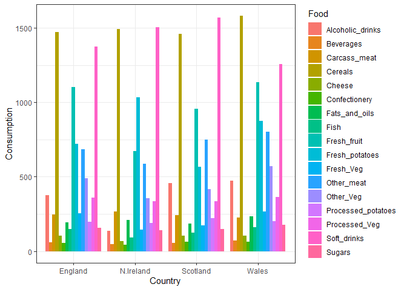

> Q4: Changing what optional argument in the above ggplot() code results
> in a stacked barplot figure?

remove position=“dodge” in geom_col()

``` r
ggplot(x_long) +
  aes(x = Country, y = Consumption, fill = Food) +
  geom_col() +
  theme_bw()
```

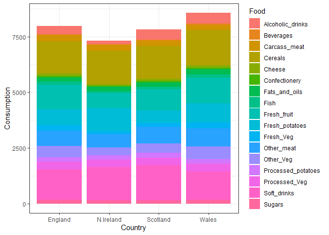

> Q5: We can use the pairs() function to generate all pairwise plots for
> our countries. Can you make sense of the following code and resulting
> figure? What does it mean if a given point lies on the diagonal for a
> given plot?

``` r
pairs(x, col=rainbow(nrow(x)), pch=16)
```


For every plot that is in the first row, the yaxis is England. Same for
the other rows, row 2 = Wales in the x-axis. For the first column,
England is on the x-axis, 2nd column = Wales = x-axis and so on. Each
point is a different food. So if the points are on the diagonal that
means both countries roughly consuem the same amount of that food. If
the point is below the line that means the country plotted on the xaxis
consumes more of it. If it is above the diagonal line that means the
country plotted on the yaxis consumes more of that food.

``` r
library(pheatmap)

pheatmap( as.matrix(x) )
```

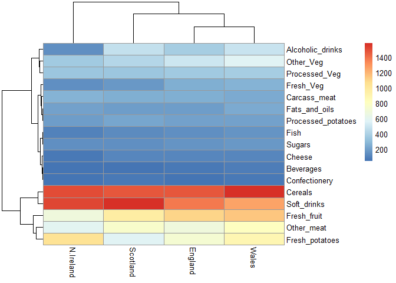

> Q6. Based on the pairs and heatmap figures, which countries cluster
> together and what does this suggest about their food consumption
> patterns? Can you easily tell what the main differences between N.
> Ireland and the other countries of the UK in terms of this data-set?

Engalnd and Wales are quite similar in their consumption of these foods.
It is a bit hard to say what is the main difference between N.Ireland
and the rest of the countries.

## PCA to the rescue

The main function in “base” R for PCA is called `prcomp()`. As we want
to do PCA on the food data for the different countries we will want the
foods in the columns.

``` r
pca <- prcomp(t(x))
summary(pca)
```

    Importance of components:
                                PC1      PC2      PC3       PC4
    Standard deviation     324.1502 212.7478 73.87622 3.176e-14
    Proportion of Variance   0.6744   0.2905  0.03503 0.000e+00
    Cumulative Proportion    0.6744   0.9650  1.00000 1.000e+00

Our result object is called `pca` and it has a `$x` component that we
will look at first

``` r
pca$x
```

                     PC1         PC2        PC3           PC4
    England   -144.99315   -2.532999 105.768945 -4.894696e-14
    Wales     -240.52915 -224.646925 -56.475555  5.700024e-13
    Scotland   -91.86934  286.081786 -44.415495 -7.460785e-13
    N.Ireland  477.39164  -58.901862  -4.877895  2.321303e-13

> Q7. Complete the code below to generate a plot of PC1 vs PC2. The
> second line adds text labels over the data points.

# Create a data frame for plotting

``` r
df <- as.data.frame(pca$x)
df$Country <- rownames(df)
```

# Plot PC1 vs PC2 with ggplot

``` r
ggplot(pca$x) +
  aes(x = PC1, y = PC2, label = rownames(pca$x)) +
  geom_point(size = 3) +
  geom_text(vjust = -0.5) +
  xlim(-270, 500) +
  xlab("PC1") +
  ylab("PC2") +
  theme_bw()
```

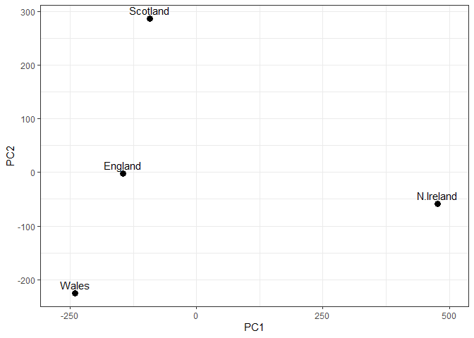

> Q8. Customize your plot so that the colors of the country names match
> the colors in our UK and Ireland map and table at start of this
> document.

``` r
cols <- c("orange", "red", "blue", "green")
ggplot(pca$x) +
  aes(x = PC1, y = PC2, label = rownames(pca$x), col=cols) +
  geom_point(size = 3) +
  geom_text(vjust = -0.5) +
  xlim(-270, 500) +
  xlab("PC1") +
  ylab("PC2") +
  theme_bw()
```

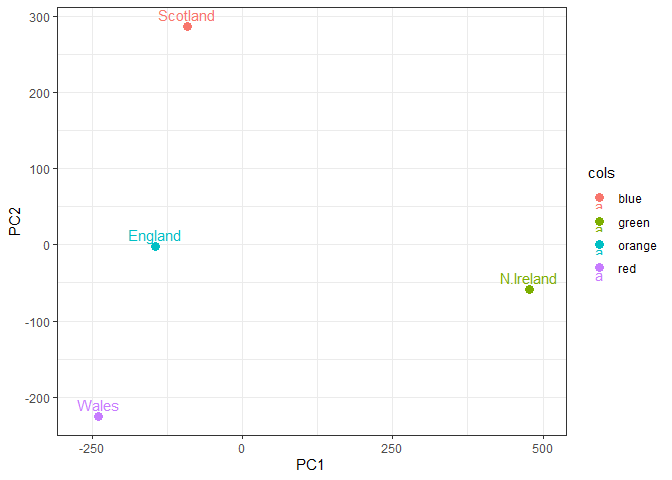

Another major result of PCA is the so-called “variable loadings” or
`$rotation` that tells us how the original variables (foods) contribute
to PCs (i.e. our new axis).

``` r
pca$rotation
```

                                 PC1          PC2         PC3          PC4
    Cheese              -0.056955380  0.016012850  0.02394295 -0.694538519
    Carcass_meat         0.047927628  0.013915823  0.06367111  0.489884628
    Other_meat          -0.258916658 -0.015331138 -0.55384854  0.279023718
    Fish                -0.084414983 -0.050754947  0.03906481 -0.008483145
    Fats_and_oils       -0.005193623 -0.095388656 -0.12522257  0.076097502
    Sugars              -0.037620983 -0.043021699 -0.03605745  0.034101334
    Fresh_potatoes       0.401402060 -0.715017078 -0.20668248 -0.090972715
    Fresh_Veg           -0.151849942 -0.144900268  0.21382237 -0.039901917
    Other_Veg           -0.243593729 -0.225450923 -0.05332841  0.016719075
    Processed_potatoes  -0.026886233  0.042850761 -0.07364902  0.030125166
    Processed_Veg       -0.036488269 -0.045451802  0.05289191 -0.013969507
    Fresh_fruit         -0.632640898 -0.177740743  0.40012865  0.184072217
    Cereals             -0.047702858 -0.212599678 -0.35884921  0.191926714
    Beverages           -0.026187756 -0.030560542 -0.04135860  0.004831876
    Soft_drinks          0.232244140  0.555124311 -0.16942648  0.103508492
    Alcoholic_drinks    -0.463968168  0.113536523 -0.49858320 -0.316290619
    Confectionery       -0.029650201  0.005949921 -0.05232164  0.001847469

Anything positive (\>0) is going to be more like N. Ireland (to the
right on the PC1 axis)

``` r
ggplot(pca$rotation) +
  aes(PC1, rownames(pca$rotation)) +
  geom_col()
```


> Q9: Generate a similar ‘loadings plot’ for PC2. What two food groups
> feature prominently and what does PC2 mainly tell us about?

``` r
ggplot(pca$rotation) +
  aes(PC2, rownames(pca$rotation)) +
  geom_col()
```


Mainly soft drinks and fresh potatoes feature prominently. In PC2, if a
food has a more positive value that means that means it’s more like
Scotland, whereas a negative value is more like Wales. Therefore PC2
shows that people in Scotland consume more soft drinks and people in
Wales have more fresh potatoes.
