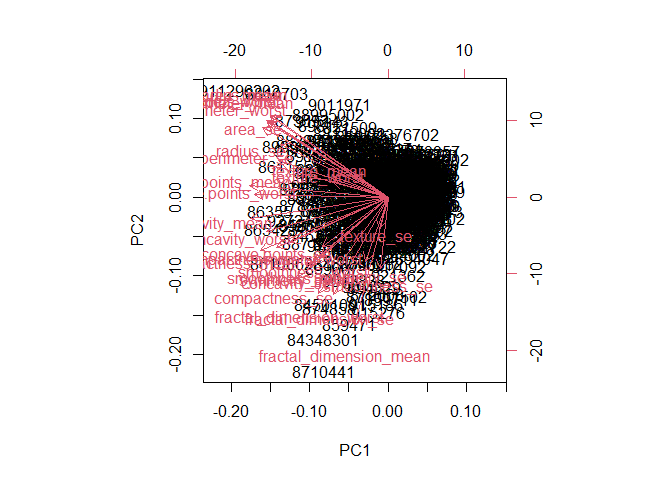
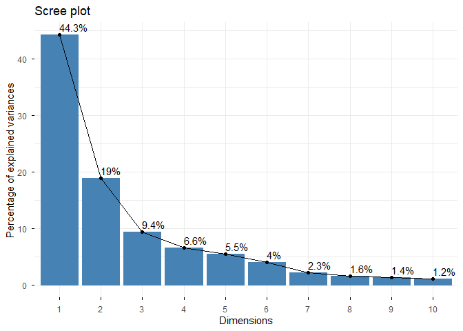
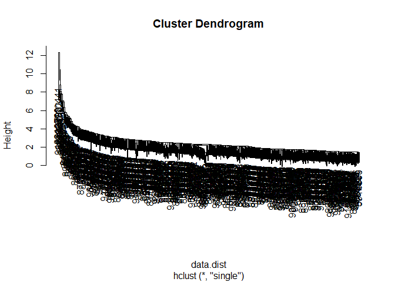
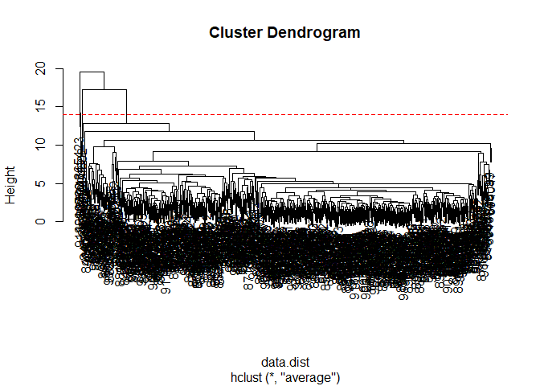
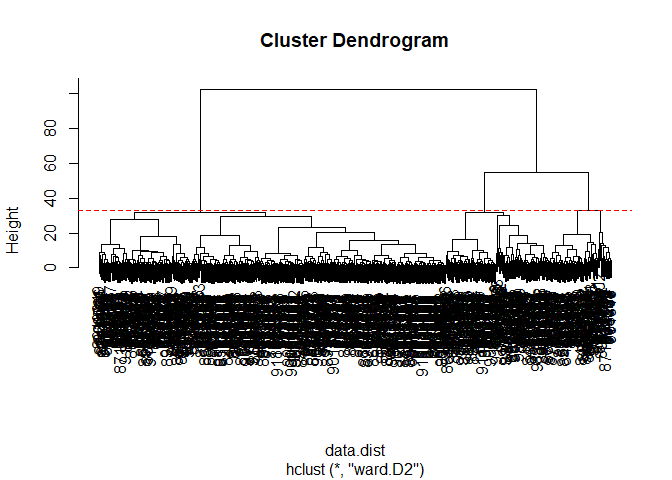
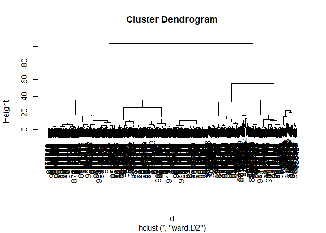
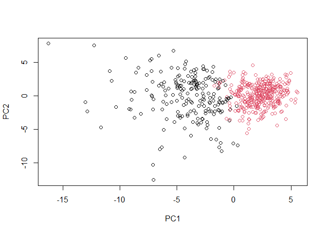
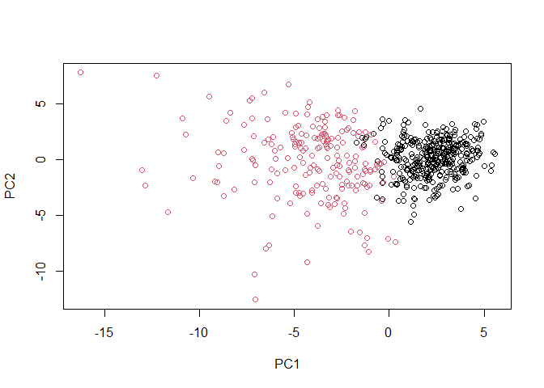

# Class 08: Breast Cancer Analysis Project
Seona Patel (PID: A69035519)

- [Background](#background)
- [Data Import](#data-import)
- [Exploratory Data Analysis](#exploratory-data-analysis)
- [Principal Component Analysis](#principal-component-analysis)
- [Interpreting PCA Results](#interpreting-pca-results)
- [Variance](#variance)
- [Communicating PCA Results](#communicating-pca-results)
- [Hierarchical Clustering](#hierarchical-clustering)
- [Results of hierarchical
  clustering](#results-of-hierarchical-clustering)
- [Selecting number of clusters](#selecting-number-of-clusters)
- [Using different methods](#using-different-methods)
- [Combining PCA and clustering](#combining-pca-and-clustering)
  - [Clustering on PCA results](#clustering-on-pca-results)

## Background

The goal of this mini-project is for you to explore a complete analysis
using the unsupervised learning techniques covered in class. We will
extend what we learned by combining PCA as a preprocessing step to
clustering using data that consist of measurements of cell nuclei of
human breast masses.

The data itself comes from the Wisconsin Breast Cancer Diagnostic Data
Set first reported by K. P. Benne and O. L. Mangasarian: “Robust Linear
Programming Discrimination of Two Linearly Inseparable Sets”.

Values in this data set describe characteristics of the cell nuclei
present in digitized images of a fine needle aspiration (FNA) of a
breast mass.

## Data Import

``` r
# Save your input data file into your Project directory
fna.data <- "WisconsinCancer.csv"

# Complete the following code to input the data and store as wisc.df
wisc.df <- read.csv(fna.data, row.names=1)
```

``` r
head(wisc.df, 3)
```

             diagnosis radius_mean texture_mean perimeter_mean area_mean
    842302           M       17.99        10.38          122.8      1001
    842517           M       20.57        17.77          132.9      1326
    84300903         M       19.69        21.25          130.0      1203
             smoothness_mean compactness_mean concavity_mean concave.points_mean
    842302           0.11840          0.27760         0.3001             0.14710
    842517           0.08474          0.07864         0.0869             0.07017
    84300903         0.10960          0.15990         0.1974             0.12790
             symmetry_mean fractal_dimension_mean radius_se texture_se perimeter_se
    842302          0.2419                0.07871    1.0950     0.9053        8.589
    842517          0.1812                0.05667    0.5435     0.7339        3.398
    84300903        0.2069                0.05999    0.7456     0.7869        4.585
             area_se smoothness_se compactness_se concavity_se concave.points_se
    842302    153.40      0.006399        0.04904      0.05373           0.01587
    842517     74.08      0.005225        0.01308      0.01860           0.01340
    84300903   94.03      0.006150        0.04006      0.03832           0.02058
             symmetry_se fractal_dimension_se radius_worst texture_worst
    842302       0.03003             0.006193        25.38         17.33
    842517       0.01389             0.003532        24.99         23.41
    84300903     0.02250             0.004571        23.57         25.53
             perimeter_worst area_worst smoothness_worst compactness_worst
    842302             184.6       2019           0.1622            0.6656
    842517             158.8       1956           0.1238            0.1866
    84300903           152.5       1709           0.1444            0.4245
             concavity_worst concave.points_worst symmetry_worst
    842302            0.7119               0.2654         0.4601
    842517            0.2416               0.1860         0.2750
    84300903          0.4504               0.2430         0.3613
             fractal_dimension_worst
    842302                   0.11890
    842517                   0.08902
    84300903                 0.08758

Make sure we do not include sample id or diagnosis columns in the data
that we analyze below.

``` r
# We can use -1 here to remove the first column
wisc.data <- wisc.df[,-1]
```

``` r
head(wisc.data, 3)
```

             radius_mean texture_mean perimeter_mean area_mean smoothness_mean
    842302         17.99        10.38          122.8      1001         0.11840
    842517         20.57        17.77          132.9      1326         0.08474
    84300903       19.69        21.25          130.0      1203         0.10960
             compactness_mean concavity_mean concave.points_mean symmetry_mean
    842302            0.27760         0.3001             0.14710        0.2419
    842517            0.07864         0.0869             0.07017        0.1812
    84300903          0.15990         0.1974             0.12790        0.2069
             fractal_dimension_mean radius_se texture_se perimeter_se area_se
    842302                  0.07871    1.0950     0.9053        8.589  153.40
    842517                  0.05667    0.5435     0.7339        3.398   74.08
    84300903                0.05999    0.7456     0.7869        4.585   94.03
             smoothness_se compactness_se concavity_se concave.points_se
    842302        0.006399        0.04904      0.05373           0.01587
    842517        0.005225        0.01308      0.01860           0.01340
    84300903      0.006150        0.04006      0.03832           0.02058
             symmetry_se fractal_dimension_se radius_worst texture_worst
    842302       0.03003             0.006193        25.38         17.33
    842517       0.01389             0.003532        24.99         23.41
    84300903     0.02250             0.004571        23.57         25.53
             perimeter_worst area_worst smoothness_worst compactness_worst
    842302             184.6       2019           0.1622            0.6656
    842517             158.8       1956           0.1238            0.1866
    84300903           152.5       1709           0.1444            0.4245
             concavity_worst concave.points_worst symmetry_worst
    842302            0.7119               0.2654         0.4601
    842517            0.2416               0.1860         0.2750
    84300903          0.4504               0.2430         0.3613
             fractal_dimension_worst
    842302                   0.11890
    842517                   0.08902
    84300903                 0.08758

``` r
# Create diagnosis vector for later 
diagnosis <- as.factor(wisc.df$diagnosis)
```

## Exploratory Data Analysis

> Q1. How many observations are in this dataset?

There are 569 rows and 30 columns in this dataset.

> Q2. How many of the observations have a malignant diagnosis?

There are 212 observations that have a malignant diagnosis.

``` r
sum(wisc.df$diagnosis == "M")
```

    [1] 212

> Q3. How many variables/features in the data are suffixed with \_mean?

``` r
#colnames(wisc.data)
length(grep("_mean", colnames(wisc.data)))
```

    [1] 10

There are 10 variables/features in the data are suffixed with “\_mean”

## Principal Component Analysis

The main function in base R for PCA is called `prcomp()`

`scale` = a logical value indicating wheehr the variables should be
scaled before the analysis happens. The default is FALSE, but generally
scaling is advisable.

We always want to `scale` our data prior to PCA to ensure that each
feature contributes equally to the analysis, preventing variables with
larger scales from overpowering.

There are as many PCs as number of variables measured in the dataset.

``` r
wisc.pr <- prcomp(wisc.data, scale=T)
summary(wisc.pr)
```

    Importance of components:
                              PC1    PC2     PC3     PC4     PC5     PC6     PC7
    Standard deviation     3.6444 2.3857 1.67867 1.40735 1.28403 1.09880 0.82172
    Proportion of Variance 0.4427 0.1897 0.09393 0.06602 0.05496 0.04025 0.02251
    Cumulative Proportion  0.4427 0.6324 0.72636 0.79239 0.84734 0.88759 0.91010
                               PC8    PC9    PC10   PC11    PC12    PC13    PC14
    Standard deviation     0.69037 0.6457 0.59219 0.5421 0.51104 0.49128 0.39624
    Proportion of Variance 0.01589 0.0139 0.01169 0.0098 0.00871 0.00805 0.00523
    Cumulative Proportion  0.92598 0.9399 0.95157 0.9614 0.97007 0.97812 0.98335
                              PC15    PC16    PC17    PC18    PC19    PC20   PC21
    Standard deviation     0.30681 0.28260 0.24372 0.22939 0.22244 0.17652 0.1731
    Proportion of Variance 0.00314 0.00266 0.00198 0.00175 0.00165 0.00104 0.0010
    Cumulative Proportion  0.98649 0.98915 0.99113 0.99288 0.99453 0.99557 0.9966
                              PC22    PC23   PC24    PC25    PC26    PC27    PC28
    Standard deviation     0.16565 0.15602 0.1344 0.12442 0.09043 0.08307 0.03987
    Proportion of Variance 0.00091 0.00081 0.0006 0.00052 0.00027 0.00023 0.00005
    Cumulative Proportion  0.99749 0.99830 0.9989 0.99942 0.99969 0.99992 0.99997
                              PC29    PC30
    Standard deviation     0.02736 0.01153
    Proportion of Variance 0.00002 0.00000
    Cumulative Proportion  1.00000 1.00000

> Q4. From your results, what proportion of the original variance is
> captured by the first principal components (PC1)?

44.27% of the variance is captured by PC1

> Q5. How many principal components (PCs) are required to describe at
> least 70% of the original variance in the data?

3 PCs are required to describe at least 70% of the original variance in
the data.

> Q6. How many principal components (PCs) are required to describe at
> least 90% of the original variance in the data?

7 PCs are required to describe at least 90% of the original variance in
the data.

## Interpreting PCA Results

``` r
biplot(wisc.pr)
```



> Q7. What stands out to you about this plot? Is it easy or difficult to
> understand? Why?

This is very difficult to understand and super chaotic because there are
so many points on the graph that overlap you can’t tell anything apart.

Let’s make our main result figure - the “PC plot” or “score plot”,
“orientation plot”….

``` r
df <- as.data.frame(wisc.pr$x)
head(df)
```

                   PC1        PC2        PC3       PC4        PC5         PC6
    842302   -9.184755  -1.946870 -1.1221788 3.6305364  1.1940595  1.41018364
    842517   -2.385703   3.764859 -0.5288274 1.1172808 -0.6212284  0.02863116
    84300903 -5.728855   1.074229 -0.5512625 0.9112808  0.1769302  0.54097615
    84348301 -7.116691 -10.266556 -3.2299475 0.1524129  2.9582754  3.05073750
    84358402 -3.931842   1.946359  1.3885450 2.9380542 -0.5462667 -1.22541641
    843786   -2.378155  -3.946456 -2.9322967 0.9402096  1.0551135 -0.45064213
                     PC7         PC8         PC9       PC10       PC11       PC12
    842302    2.15747152  0.39805698 -0.15698023 -0.8766305 -0.2627243 -0.8582593
    842517    0.01334635 -0.24077660 -0.71127897  1.1060218 -0.8124048  0.1577838
    84300903 -0.66757908 -0.09728813  0.02404449  0.4538760  0.6050715  0.1242777
    84348301  1.42865363 -1.05863376 -1.40420412 -1.1159933  1.1505012  1.0104267
    84358402 -0.93538950 -0.63581661 -0.26357355  0.3773724 -0.6507870 -0.1104183
    843786    0.49001396  0.16529843 -0.13335576 -0.5299649 -0.1096698  0.0813699
                    PC13         PC14         PC15        PC16        PC17
    842302    0.10329677 -0.690196797  0.601264078  0.74446075 -0.26523740
    842517   -0.94269981 -0.652900844 -0.008966977 -0.64823831 -0.01719707
    84300903 -0.41026561  0.016665095 -0.482994760  0.32482472  0.19075064
    84348301 -0.93245070 -0.486988399  0.168699395  0.05132509  0.48220960
    84358402  0.38760691 -0.538706543 -0.310046684 -0.15247165  0.13302526
    843786   -0.02625135  0.003133944 -0.178447576 -0.01270566  0.19671335
                    PC18       PC19        PC20         PC21        PC22
    842302   -0.54907956  0.1336499  0.34526111  0.096430045 -0.06878939
    842517    0.31801756 -0.2473470 -0.11403274 -0.077259494  0.09449530
    84300903 -0.08789759 -0.3922812 -0.20435242  0.310793246  0.06025601
    84348301 -0.03584323 -0.0267241 -0.46432511  0.433811661  0.20308706
    84358402 -0.01869779  0.4610302  0.06543782 -0.116442469  0.01763433
    843786   -0.29727706 -0.1297265 -0.07117453 -0.002400178  0.10108043
                    PC23         PC24         PC25         PC26        PC27
    842302    0.08444429  0.175102213  0.150887294 -0.201326305 -0.25236294
    842517   -0.21752666 -0.011280193  0.170360355 -0.041092627  0.18111081
    84300903 -0.07422581 -0.102671419 -0.171007656  0.004731249  0.04952586
    84348301 -0.12399554 -0.153294780 -0.077427574 -0.274982822  0.18330078
    84358402  0.13933105  0.005327110 -0.003059371  0.039219780  0.03213957
    843786    0.03344819 -0.002837749 -0.122282765 -0.030272333 -0.08438081
                      PC28         PC29          PC30
    842302   -0.0338846387  0.045607590  0.0471277407
    842517    0.0325955021 -0.005682424  0.0018662342
    84300903  0.0469844833  0.003143131 -0.0007498749
    84348301  0.0424469831 -0.069233868  0.0199198881
    84358402 -0.0347556386  0.005033481 -0.0211951203
    843786    0.0007296587 -0.019703996 -0.0034564331

``` r
library(ggplot2)
```

    Warning: package 'ggplot2' was built under R version 4.5.2

``` r
ggplot(wisc.pr$x) +
  aes(PC1, PC2, col=diagnosis) +
  geom_point()
```


> Q8. Generate a similar plot for principal components 1 and 3. What do
> you notice about these plots?

``` r
ggplot(wisc.pr$x) +
  aes(PC1, PC3, col=diagnosis) +
  geom_point()
```


Since PC3 captures less variance than PC2, the distinction between
clusters is less apparent in this plot. Overall, the plots indicate that
principal component 1 is capturing a separation of malignant (blue) from
benign (pink) samples.

## Variance

In this exercise, you will produce scree plots showing the proportion of
variance explained as the number of principal components increases. The
data from PCA must be prepared for these plots, as there is not a
built-in function in base R to create them directly from the PCA model.

As you look at these plots, ask yourself if there’s an ‘elbow’ in the
amount of variance explained that might lead you to pick a natural
number of principal components. If an obvious elbow does not exist, as
is typical in some real-world datasets, consider how else you might
determine the number of principal components to retain based on the
scree plot.

Calculate the variance of each principal component by squaring the sdev
component of wisc.pr (i.e. wisc.pr\$sdev^2). Save the result as an
object called pr.var.

``` r
# Calculate variance of each component
pr.var <- wisc.pr$sdev^2
head(pr.var)
```

    [1] 13.281608  5.691355  2.817949  1.980640  1.648731  1.207357

``` r
# Variance explained by each principal component: pve
pve <- pr.var / sum(pr.var)

# Plot variance explained for each principal component
plot(pve, xlab = "Principal Component", 
     ylab = "Proportion of Variance Explained", 
     ylim = c(0, 1), type = "o")
```


``` r
## ggplot based graph

library(factoextra)
```

    Welcome! Want to learn more? See two factoextra-related books at https://goo.gl/ve3WBa

``` r
fviz_eig(wisc.pr, addlabels = TRUE)
```

    Warning in geom_bar(stat = "identity", fill = barfill, color = barcolor, :
    Ignoring empty aesthetic: `width`.



## Communicating PCA Results

In this section we will check your understanding of the PCA results, in
particular the loadings and variance explained. The loadings,
represented as vectors, explain the mapping from the original features
to the principal components. The principal components are naturally
ordered from the most variance explained to the least variance
explained.

> Q9. For the first principal component, what is the component of the
> loading vector (i.e. wisc.pr\$rotation\[,1\]) for the feature
> concave.points_mean? This tells us how much this original feature
> contributes to the first PC.

``` r
wisc.pr$rotation["concave.points_mean", 1]
```

    [1] -0.2608538

-0.26085376 is the component of the loading vector for the feature
concave.points_mean.

## Hierarchical Clustering

The goal of this section is to do hierarchical clustering of the
original data. Recall from class that this type of clustering does not
assume in advance the number of natural groups that exist in the data
(unlike K-means clustering).

As part of the preparation for hierarchical clustering, the distance
between all pairs of observations are computed. Furthermore, there are
different ways to link clusters together, with single, complete, and
average being the most common “linkage methods”.

First scale the `wisc.data` data and assign the result to `data.scaled`.

``` r
# Scale the wisc.data data using the "scale()" function
data.scaled <- scale(wisc.data)
```

Calculate the (Euclidean) distances between all pairs of observations in
the new scaled dataset and assign the result to `data.dist`.

``` r
data.dist <- dist(data.scaled)
```

Create a hierarchical clustering model using complete linkage. Manually
specify the method argument to `hclust()` and assign the results to
`wisc.hclust`.

``` r
wisc.hclust <- hclust(data.dist, method = "complete")
```

## Results of hierarchical clustering

Let’s use the hierarchical clustering model you just created to
determine a height (or distance between clusters) where a certain number
of clusters exists.

> Q10. Using the plot() and abline() functions, what is the height at
> which the clustering model has 4 clusters?

``` r
plot(wisc.hclust)
abline(h=19, col="red", lty=2)
```


The height at which there are 4 clusters is 19.

## Selecting number of clusters

In this section, you will compare the outputs from your hierarchical
clustering model to the actual diagnoses. Normally when performing
unsupervised learning like this, a target variable (i.e. known answer or
labels) isn’t available. We do have it with this dataset, however, so it
can be used to check the performance of the clustering model.

When performing supervised learning - that is, when you’re trying to
predict some target variable of interest and that target variable is
available in the original data - using clustering to create new features
may or may not improve the performance of the final model.

This exercise will help you determine if, in this case, hierarchical
clustering provides a promising new feature.

Use `cutree()` to cut the tree so that it has 4 clusters. Assign the
output to the variable `wisc.hclust.clusters`.

``` r
wisc.hclust.clusters <- cutree(wisc.hclust, k=4)
```

We can use the table() function to compare the cluster membership to the
actual diagnoses.

``` r
table(wisc.hclust.clusters, diagnosis)
```

                        diagnosis
    wisc.hclust.clusters   B   M
                       1  12 165
                       2   2   5
                       3 343  40
                       4   0   2

## Using different methods

As we discussed in our last class videos there are number of different
“methods” we can use to combine points during the hierarchical
clustering procedure. These include “single”, “complete”, “average” and
(my favorite) “ward.D2”

> Q12. Which method gives your favorite results for the same data.dist
> dataset? Explain your reasoning.

Based on the graphs below, I like ward.D2 the most because it provides
the clearest distinction on 2 clusters and minimizes within-cluster
variance. With “single” it is very difficult to distinguish even 2
clusters since so many are made. The “average” and “complete” methods
are much better than “single”, but “ward.D2” gives the clearest
distinction of 2 clusters out of all of the methods.

``` r
wisc.hclust.single <- hclust(data.dist, method = "single")
plot(wisc.hclust.single)
```



``` r
#abline(h=19, col="red", lty=2)
```

``` r
wisc.hclust.average <- hclust(data.dist, method = "average")
plot(wisc.hclust.average)
abline(h=14, col="red", lty=2)
```



``` r
wisc.hclust.ward.D2 <- hclust(data.dist, method = "ward.D2")
plot(wisc.hclust.ward.D2)
abline(h=33, col="red", lty=2)
```



## Combining PCA and clustering

### Clustering on PCA results

In this final section, you will put together several steps you used
earlier and, in doing so, you will experience some of the creativity and
open endedness that is typical in unsupervised learning.

Recall from earlier sections that the PCA model required significantly
fewer features to describe 70%, 80% and 95% of the variability of the
data. In addition to normalizing data and potentially avoiding
over-fitting, PCA also uncorrelates the variables, sometimes improving
the performance of other modeling techniques.

Let’s see if PCA improves or degrades the performance of hierarchical
clustering.

Using the minimum number of principal components required to describe at
least 90% of the variability in the data, create a hierarchical
clustering model with the linkage `method="ward.D2"`. We use Ward’s
criterion here because it is based on multidimensional variance like
principal components analysis. Assign the results to `wisc.pr.hclust`.

``` r
#Get the first three PCs and pass through dist function to calculate Euclidian distance
d <- dist(wisc.pr$x[,1:3])
#cluster
wisc.pr.hclust <- hclust(d, method="ward.D2")
#plot
plot(wisc.pr.hclust)
abline(h=70, col='red')
```



This looks much more promising than our previous clustering results on
the original scaled data. Note the two main branches of or dendrogram
indicating two main clusters - maybe these are malignant and benign.
Let’s find out!

Get my cluster membership vector

``` r
grps <- cutree(wisc.pr.hclust, h=70)
table(grps)
```

    grps
      1   2 
    203 366 

``` r
table(diagnosis)
```

    diagnosis
      B   M 
    357 212 

Make a wee “cross-table”

``` r
table(grps, diagnosis)
```

        diagnosis
    grps   B   M
       1  24 179
       2 333  33

So this shows that cluster 1 is indicative of malignant, and cluster 2
is indicative of benign. From this, we can also interpret the number of
TP, FP, TN, and FN results. True Positive (TP)= 179 False Positive (FP)
= 24 True Negative (TN) = 333 False Negative (FN)= 33

Sensitivity: TP/(TP+FN)

``` r
plot(wisc.pr$x[,1:2], col=grps)
```



``` r
plot(wisc.pr$x[,1:2], col=diagnosis)
```


``` r
g <- as.factor(grps)
levels(g)
```

    [1] "1" "2"

``` r
g <- relevel(g,2)
levels(g)
```

    [1] "2" "1"

``` r
# Plot using our re-ordered factor 
plot(wisc.pr$x[,1:2], col=g)
```



``` r
## Use the distance along the first 7 PCs for clustering i.e. wisc.pr$x[, 1:7]
wisc.pr.hclust <- hclust(dist(wisc.pr$x[,1:7]), method="ward.D2")
```

Cut this hierarchical clustering model into 2 clusters and assign the
results to wisc.pr.hclust.clusters.

``` r
wisc.pr.hclust.clusters <- cutree(wisc.pr.hclust, k=2)
```

Using table(), compare the results from your new hierarchical clustering
model with the actual diagnoses.

> Q13. How well does the newly created model with four clusters separate
> out the two diagnoses?

``` r
table(wisc.pr.hclust.clusters, diagnosis)
```

                           diagnosis
    wisc.pr.hclust.clusters   B   M
                          1  28 188
                          2 329  24

``` r
table(wisc.df$diagnosis)
```


      B   M 
    357 212 

This newly created model does pretty well in separating out the two
diagnoses, but still has some false positives (28) and false negatives
(24).

> Q14. How well do the hierarchical clustering models you created in
> previous sections (i.e. before PCA) do in terms of separating the
> diagnoses? Again, use the table() function to compare the output of
> each model (wisc.km\$cluster and wisc.hclust.clusters) with the vector
> containing the actual diagnoses.

``` r
table(wisc.hclust.clusters, diagnosis)
```

                        diagnosis
    wisc.hclust.clusters   B   M
                       1  12 165
                       2   2   5
                       3 343  40
                       4   0   2

Based on the vector with the actual diagnoses, it seems that after PCA,
cluster 1 contains mostly M diagnoses and cluster 2 contains mostly B
diagnoses, with fewer misclassified cases compared to clustering before
PCA.So PCA improved the separation of diagnoses in the hierarchical
clustering model
