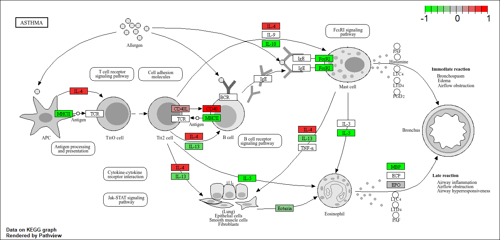

## 1. Background
Today we will analyze soem RNAseq data from Himes et al. on the effects of a common steroid dexamethasone (dex) on airway smooth muscle cells (ASMs).

The data for this hands-on session comes from a published RNA-seq experiment where airway smooth muscle cells were treated with dexamethasone, a synthetic glucocorticoid steroid with anti-inflammatory effects (Himes et al. 2014).

Glucocorticoids are used, for example, by people with asthma to reduce inflammation of the airways (Figure 1). The anti-inflammatory effects on airway smooth muscle (ASM) cells has been known for some time but the underlying molecular mechanisms are unclear.

Himes et al. used RNA-seq to profile gene expression changes in four different ASM cell lines treated with dexamethasone glucocorticoid.

They found a number of differentially expressed genes but focus much of the discussion on a gene called CRISPLD2.

This gene encodes a secreted protein known to be involved in lung development, and SNPs in this gene in previous GWAS studies are associated with inhaled corticosteroid resistance and bronchodilator response in asthma patients.


For this analysis, we need 2 main inputs: 

- `countData`: a table of **counts** per gene (in rows) across experiments (in columns)
- `colData`: **metadata** about the design of the experiments. The rows here must match the columns in `countData`

## Data Import

```{r}
counts <- read.csv("airway_scaledcounts.csv", row.names=1)
metadata <- read.csv("airway_metadata.csv")
```


Let's have a wee peak at our `counts` data

```{r}
head(counts)
```
The IDs are for each gene in the ensemble database. 

```{r}
metadata
```

Note that the rows match the columns in counts. 


> Q1. How many "genes" are in this dataset?

```{r}
nrow(counts)
```
There are 38694 genes in the dataset.


> Q2. How many experiments (i.e. columns in `counts` or rows in `metadata`) are there?

```{r}
ncol(counts)
```
There are 8 experiments.


> Q3. How many control experiments? 

```{r}
sum(metadata$dex == "control")
```
There are 4 control experiments. 

## Toy analysis 

1. Extract the "control" columns from counts
2. Calculate the mean value for each gene in "control" columns
3-4. Do the same for the "treated" columns
5. Compare these mean values for each gene

Step 1:
```{r}
control.inds <- metadata$dex == "control"
control.counts <- counts[,control.inds]
```

Step 2:
```{r}
control.mean <- rowMeans(control.counts)
```

Step 3:
```{r}
treated.inds <- metadata$dex == "treated"
treated.counts <- counts[,treated.inds]
```

Step 4:
```{r}
treated.mean <- rowMeans(treated.counts)
```

Step 5: 
```{r}
meancounts <- data.frame(control.mean, treated.mean)
head(meancounts)
```

> Q5 Create a scatter plot showing the mean of the treated samples against the mean of the control samples. You could also use 

```{r}
plot(meancounts[,1], meancounts[,2], xlab="Control", ylab="Treated")
```
> Q5b. You could also use ggplot2 package to make this figure producing the plot below. What geom_?() function would you use for this plot? 

I would use geom_point()

```{r}
# in base R: plot(meancounts)
library(ggplot2)
ggplot(meancounts) + aes(control.mean, treated.mean) +
  geom_point(alpha=0.2) 
```
This graph is super skewed, need to log it. 

> Q6. Try plotting both axes on a log scale. What is teh argument to plot() that allows you to do this? 

```{r}
plot(meancounts[,1], meancounts[,2], log="xy", xlab="log Control", ylab="log Treated")
```


```{r}

library(ggplot2)
ggplot(meancounts) + aes(control.mean, treated.mean) +
  geom_point(alpha=0.2) +
  scale_x_log10() +
  scale_y_log10()
```

We use log2 "fold-change" as a way to compare 
Log2 is easier to interpret than log10 because the output is easier to interpret. 

```{r}
# treated/control
log2(10/10)
log2(20/10)
log10(20/10)
log2(10/20)
log2(40/10)
```

Now lets add a row with the log2 FC: 

```{r}
meancounts$log2fc <- log2(meancounts$treated.mean/meancounts$control.mean)
head(meancounts)
```
A common "rule-of-thumb" threshold to say if something is up-regulated is a log2FC of > +2 or for down-regulated is log2FC < -2. 

There are 2 ways to deal with datasets that have 0 in it. One is Pseudocounts = add a small number to all genes. The better way is to just remove rows that have 0 in it because why would you want to analyze genes that aren't detected anyways. Including them in the analysis will reduce the power of the analysis. 

## Filter out zero count genes

```{r}
x <- c(1,5,0,5)
which(x==0)
```

```{r}
y <- data.frame(a=c(1,5,0,5), b=c(1,0,5,5))
y==0
```
```{r}
which(y==0)
```
```{r}
which(y==0, arr.ind=T)[,1]
```

only care about which gene (the row)

```{r}
zero.inds <- which(meancounts[,1:2] == 0, arr.ind = T)[,1]
mygenes <- meancounts[-zero.inds,]
```

> Q8 How many genes are "up" regulated at the +2 log2FC threshold? 

```{r}
sum(mygenes$log2fc > 2)
```

> Q9 How many genes are "down" regulated at the -2 log2FC threshold? 

```{r}
sum(mygenes$log2fc < -2)
```
Don't really trusy this, we need statistics...


## DESeq Analysis

Let's do this with DESeq2 and put some stats behind these numbers.

```{r, message=FALSE}
library(DESeq2)
```

DESeq wants 3 things for analysis, countData, colData, and design


```{r}
dds <- DESeqDataSetFromMatrix(countData=counts, 
                       colData = metadata, 
                       design= ~dex)
```

The main function in the DESeq package to run analysis is called `DESeq()`

```{r}
dds <- DESeq(dds)
```
Get the results out of this DESeq object with the function `results()`

```{r}
res <- results(dds)
head(res)
```
## Save our results
```{r}
write.csv(res, file="myresults.csv")

```

## Volcano Plot 

This is a plot of log2FC vs the adjusted p-value (x= log2FC, y=padj)

```{r}
plot(res$log2FoldChange, -log(res$padj))
abline(v=c(-2,2), col="red")
abline(h=-log(0.05), col="red")
```
A nicer ggplot volcano plot

```{r}

mycols <- rep("gray", nrow(res))
mycols[abs(res$log2FoldChange)>2] <- "blue"
mycols[res$padj >= 0.05] <- "grey"

ggplot(res) + aes(log2FoldChange, -log(padj)) +
  geom_point(col=mycols)
   
  
```


11/12/2025

## Adding annotation data 

Our result table so far only contains the Ensembl gene IDs. However, alternative gene names and extra annotation are usually required for informative interpretation of our results. In this section we will add this necessary annotation data to our results.

We need to add gene symbols, gene names, and other database ids to make my results useful for further analysis. 


```{r}
head(res)
```


We have ENSEMBLE database in our `res` object. 

```{r}
head(rownames(res))
```


We can use `mapIds()` function from bioconductor **AnnotationDbi** to help us.  


We will use one of Bioconductor’s main annotation packages to help with mapping between various ID schemes. Here we load the **AnnotationDbi** package and the annotation data package for humans **org.Hs.eg.db.**

```{r}
library("AnnotationDbi")
library("org.Hs.eg.db")
```

columns are the kinds of things that can be retrieved from the database.
Let's see what database id formats we can translate between:
```{r}
columns(org.Hs.eg.db)
```

We can use the `mapIds()` function to add individual columns to our results table. We provide the row names of our results table as a key, and specify that `keytype=ENSEMBL`. The **column** argument tells the `mapIds()` function which information we want, and the **multiVals** argument tells the function what to do if there are multiple possible values for a single input value. Here we ask to just give us back the first one that occurs in the database.


```{r}
res$symbol <- mapIds(org.Hs.eg.db,
                     keys=row.names(res), # Our genenames
                     keytype="ENSEMBL",   # The format of our genenames
                     column="SYMBOL",     # The new format we want to add
                     multiVals="first")
```


> Q11. Run the mapIds() function two more times to add the Entrez ID and UniProt accession and GENENAME as new columns called `res$entrez`, `res$uniprot`, and `res$genename`.

```{r}
res$entrez <- mapIds(org.Hs.eg.db,
                     keys=row.names(res),
                     column="ENTREZID",
                     keytype="ENSEMBL",
                     multiVals="first")

res$uniprot <- mapIds(org.Hs.eg.db,
                     keys=row.names(res),
                     column="UNIPROT",
                     keytype="ENSEMBL",
                     multiVals="first")

res$genename <- mapIds(org.Hs.eg.db,
                     keys=row.names(res),
                     column="GENENAME",
                     keytype="ENSEMBL",
                     multiVals="first")

head(res)
```
## Save my annotated results 

```{r}
write.csv(res,file="myresults_annotated.csv")
```


You can arrange and view the results by the adjusted p-value

```{r}
ord <- order( res$padj )
head(res[ord,])
```
Finally, let’s write out the ordered significant results with annotations. See the help for ?write.csv if you are unsure here.

```{r}
write.csv(res[ord,], "deseq_results.csv")
```

## Pathway Analysis

Here we play with just one, the rather old (i.e. well established) **GAGE package** (which stands for Generally Applicable Gene set Enrichment), to do KEGG pathway enrichment analysis on our RNA-seq based differential expression results.


The KEGG pathway database, unlike GO for example, provides functional annotation as well as information about gene products that interact with each other in a given pathway, how they interact (e.g., activation, inhibition, etc.), and where they interact (e.g., cytoplasm, nucleus, etc.). Hence KEGG has the potential to provide extra insight beyond annotation lists of simple molecular function, process etc. from GO terms.

```{r}
library(pathview)
library(gage)
library(gageData)
data(kegg.sets.hs)

#examine the first 2 pathways in this kegg set for humans
head(kegg.sets.hs, 2)
```

The main `gage()` function requires a named vector of **fold changes**, where the **names** of the values are the **Entrez gene IDs**.

Note that we used the `mapIDs()` function above to obtain Entrez gene IDs (stored in `res$entrez`) and we have the fold change results from DESeq2 analysis (stored in `res$log2FoldChange`).

What **gage** wants as an input is a named vector of importance i.e. a vector with labled fold-changes.
use `names()` to set the names to the **Entrez ID**

```{r}
foldchanges = res$log2FoldChange
names(foldchanges) = res$entrez
head(foldchanges)
```

Now, let’s run the `gage()` pathway analysis.

```{r}
# Get the results
keggres = gage(foldchanges, gsets=kegg.sets.hs)
```

Now lets look at the object returned from gage().

```{r}
attributes(keggres)
```

It is a list with three elements, “greater”, “less” and “stats”.

You can also see this in your Environment panel/tab window of RStudio or use the R command str(keggres).

Like any list we can use the dollar syntax to access a named element, e.g. head(keggres$greater) and head(keggres$less).

Lets look at the first few down (less) pathway results:

```{r}
# Look at the first three down (less) pathways
head(keggres$less, 3)
```

Each keggres$less and keggres$greater object is data matrix with gene sets as rows sorted by p-value.

The top three Kegg pathways indicated here include Graft-versus-host disease, Type I diabetes and the Asthma pathway (with pathway ID hsa05310).

Now, let’s try out the `pathview()` function from the pathview package to make a pathway plot with our RNA-Seq expression results shown in color.
To begin with lets manually supply a pathway.id (namely the first part of the "hsa05310 Asthma") that we could see from the print out above.

```{r, message=FALSE}
pathview(gene.data=foldchanges, pathway.id="hsa05310")
```

This downloads the pathway figure data from KEGG and adds our results to it. Here is the default low resolution raster PNG output from the pathview() call above:

Insert figure for this pathway: 


